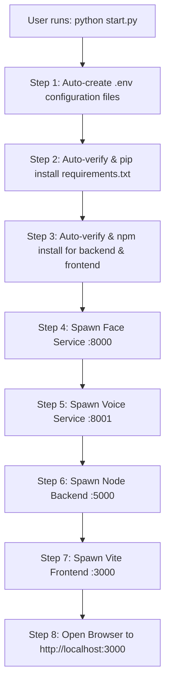

# 🎓 Cloud-Based Teacher Attendance System

A multi-biometric (Face + Voice) attendance tracking system built with Python microservices (FastAPI, OpenCV, Resemblyzer), a Node.js Express backend, and a modern Vite JavaScript frontend.

---

## 🚀 Quick Start (One-Command Launch)

If you have cloned this codebase, you **only need to run a single command**. The master launcher (`start.py`) will automatically verify, download, and install all missing Python and Node.js dependencies, configure environment files, start all microservices, and launch the web interface in your browser.

```bash
python start.py
```
> *(Alternative: `python run.py` works identically)*

---

## 📜 Table of Contents
1. [Architecture Overview](#-architecture-overview)
2. [Master Launcher (`start.py`) vs Native Commands](#-master-launcher-startpy-vs-native-commands)
3. [Underlying Native Commands Breakdown](#-underlying-native-commands-breakdown)
4. [How the Master Launcher Was Built](#-how-the-master-launcher-was-built)
5. [Environment & Configuration](#-environment--configuration)
6. [Testing & Verification](#-testing--verification)

---

## 🧠 Architecture Overview

The system consists of 4 concurrent services working together:

| Service | Technology | Port | Endpoint / Purpose |
| :--- | :--- | :--- | :--- |
| **Face Service** | Python, FastAPI, OpenCV YN/SF | `:8000` | `http://localhost:8000` (Face detection, recognition & liveness WS) |
| **Voice Service** | Python, FastAPI, Resemblyzer | `:8001` | `http://localhost:8001` (256-dim Resemblyzer speaker verification) |
| **Node Backend** | Node.js, Express, Mongoose | `:5000` | `http://localhost:5000/api` (REST API & MongoDB business logic) |
| **Frontend UI** | JavaScript (ES6+), Vite | `:3000` | `http://localhost:3000` (Web Interface) |

---

## ⚡ Master Launcher (`start.py`) vs Native Commands

Instead of requiring users to open 4 separate terminal windows, manually install dependencies, configure environment variables, and start servers individually, `start.py` encapsulates all step-by-step native commands into a single executable script.



---

## 🛠️ Underlying Native Commands Breakdown

If you prefer to run the system manually without the master script, here are the native commands that `start.py` automates:

### 1. Installing Dependencies
```bash
# Python Dependencies
pip install -r requirements.txt

# Node Backend Dependencies
cd backend
npm install
cd ..

# Frontend Dependencies
cd frontend
npm install
cd ..
```

### 2. Seeding Initial Database Records (Optional)
```bash
node seed.js
```

### 3. Starting Microservices (Requires 4 Separate Terminals)

* **Terminal 1 — Face Microservice**:
  ```bash
  python face_service.py
  ```

* **Terminal 2 — Voice Microservice**:
  ```bash
  python voice_service.py
  ```

* **Terminal 3 — Node.js Backend API**:
  ```bash
  cd backend
  npm run dev
  ```

* **Terminal 4 — Vite Frontend UI**:
  ```bash
  cd frontend
  npm run dev
  ```

---

## 🔧 How the Master Launcher Was Built

The master launcher (`start.py` / `run.py`) was engineered using Python's core libraries (`subprocess`, `threading`, `importlib`, `urllib.request`, `webbrowser`, `signal`) to replace manual operations with automated lifecycle management:

1. **Automated Package Installation (`check_and_install_imports`)**:
   - Inspects installed Python libraries against `requirements.txt` using `importlib`.
   - If any required library (e.g. `torch`, `scipy`, `resemblyzer`, `opencv-contrib-python`) is missing or outdated, it automatically executes `pip install -r requirements.txt` before launching services.

2. **Automated Node Dependency Setup (`ensure_npm_deps`)**:
   - Checks for `node_modules` folders in `backend/` and `frontend/`.
   - Runs `npm install` automatically if dependencies are uninstalled.

3. **Automated Environment Setup (`ensure_env_files`)**:
   - Auto-generates default `.env` files for `backend/` and `frontend/` if they do not exist.

4. **Process Concurrency & Live Output Streaming (`subprocess.Popen` & `threading`)**:
   - Spawns all 4 processes concurrently.
   - Streams log output in real-time with color-coded labels (`[FaceService]`, `[VoiceService]`, `[Backend]`, `[Frontend]`).

5. **Health-Check Polling & Graceful Shutdown (`wait_for_service` & `signal`)**:
   - Polls `/health` endpoints using `urllib.request` to ensure dependent services are online before launching the frontend.
   - Traps `Ctrl+C` (SIGINT/SIGTERM) to gracefully terminate all 4 subprocesses simultaneously.

---

## 🔑 Environment & Configuration

Default configuration created automatically by `start.py`:

* **`backend/.env`**:
  ```env
  PORT=5000
  MONGODB_URI=mongodb://localhost:27017/teacher_attendance
  JWT_SECRET=super_secret_jwt_key_12345
  FACE_SERVICE_URL=http://localhost:8000
  VOICE_SERVICE_URL=http://localhost:8001
  ```

* **`frontend/.env`**:
  ```env
  VITE_API_URL=http://localhost:5000/api
  VITE_FACE_SERVICE_URL=http://localhost:8000
  VITE_VOICE_SERVICE_URL=http://localhost:8001
  ```

---

## 🧪 Testing & Verification

Run all automated unit and integration tests across both Python and Node.js codebases:

```bash
python start.py --test
```

Or run test suites individually:
```bash
# Python test suite (pytest)
python -m pytest tests/

# Node backend test suite (Jest)
cd backend && npm test
```
